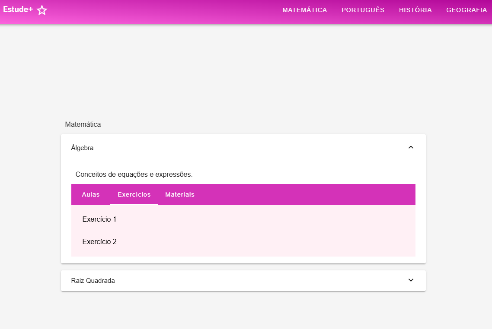

<h1 align="center">Subjects</h1>

<div align="center">
  <strong>🚀 Descrição do Repositório </strong>
</div>

<div align="center">
  <p>Um projeto que constitui em um accordion</p>
  <p>Os accordions contém materiais de estudos, separados por matéria, tema, exercícios em pdf, aulas em vídeo ou leitura.</p>
  <p>Espero que gostem 😄</p>
</div>

## 🔭 Visão Geral


Este projeto trata-se de uma SPA (Single Page Application), usando um scroll smooth. Com isso, foi utilizado o vue [router](https://router.vuejs.org/) para melhor usabilidade.

<div  align="center">
  
</div>

## 💻 Tecnologias e itens utilizados

- [Vue.js](https://vuejs.org/guide/quick-start.html) framework
- [Typescript](https://www.typescriptlang.org/) para tipagem
- [HTML](https://developer.mozilla.org/pt-BR/docs/Web/HTML) para a base
- [CSS](https://www.w3schools.com/cssref/index.php) para estilizar
- [Eslint](https://eslint.org/) para ajudar a encontrar e corrigir problemas em Javascript
- [Prettier](https://prettier.io/) para formatação de código
- [Vite](https://vite.dev/guide/) para rapidez no build
- [Vue i18n](https://vue-i18n.intlify.dev/) para internalização de texto
- [Axios](https://www.npmjs.com/package/axios) - para consumo de dados
- [Mock.js](https://www.npmjs.com/package/mockjs) para mock dos dados
- [Pinia](https://pinia.vuejs.org/introduction.html) para gerenciamento de estado
- [Vuetify](https://vuetifyjs.com/en/) para componentes
- [Paleta](https://paletadecores.com/paleta/fc63dd/e84acb/d432b8/c019a6/ac0093/) de cores utilizada neste projeto
- [Emojis](https://www.invertexto.com/emojis-para-copiar) para copiar

## 🛠 Recomendação de Setup e IDE

[VSCode](https://code.visualstudio.com/) + [Volar](https://marketplace.visualstudio.com/items?itemName=Vue.volar) (e desabilitado o Vetur).

## ⚙️ Configuração do Ambiente

```sh
git clone git@github.com:Ana-Alice-Honorio/subjects.git
```

```
cd subjects
```

```sh
npm install
```

### Compilar e reload para desenvolvimento

```sh
npm run dev
```

### Produção

```sh
npm run build
```

### Lint com [ESLint](https://eslint.org/)

```sh
npm run lint
```
